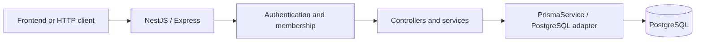

# 1. Project overview and boundaries

[Home](README.md) · Next: [Setup](02-project-setup.md)

## Level 1: beginner explanation

Imagine a team planning a website launch. People register accounts, create a project, add teammates, and record tasks. A task can have an assignee, priority, due date, labels, and comments. A frontend or HTTP client sends requests; this repository supplies the backend, not a browser interface.

Likely users are collaborating team members and developers building clients for them. That audience follows from the models; no industry-specific customer requirement is documented.

## Level 2: developer explanation

| Module         | Responsibility                                    | Persistence            |
| -------------- | ------------------------------------------------- | ---------------------- |
| AuthModule     | Registration, password checking, token issuance   | User                   |
| UsersModule    | Read/update your profile                          | User                   |
| ProjectsModule | Projects and membership                           | Project, ProjectMember |
| TasksModule    | Tasks, status, assignment, filtering, label links | Task, TaskLabel        |
| LabelsModule   | Project classification labels                     | Label                  |
| CommentsModule | Task discussion and pagination                    | Comment                |

[AppModule](../src/app.module.ts) combines these with configuration, Prisma, throttling, a JWT guard, and request logging. [HealthController](../src/app.controller.ts) supplies liveness; there is no separate health module.

## Level 3: architecture explanation

One API process contains all modules. The database is the external runtime service. This diagram simplifies the pipeline: guards actually execute before controller handlers, as explained in [request lifecycle](12-request-lifecycle-and-data-flows.md).

## Scope and boundaries

Projects are the collaboration boundary. Membership connects users to projects; assignment connects a task to an optional user. Labels belong to a project. A service check prevents attaching a different project's label to a task. These are business rules, unlike merely checking that a value is a string.

Statuses are TODO, IN_PROGRESS, IN_REVIEW, and DONE. Any of these can replace another: a transition graph is **not currently implemented**. Priorities are LOW, MEDIUM, HIGH, and URGENT. Due dates are stored but do not schedule reminders.

A user directory, email sending, uploads, payments, refresh tokens, logout endpoint, Redis/cache, message queue, scheduled jobs, and WebSockets are **not currently implemented**. Do not infer them from installed tooling or familiar task-board products.

The application controls HTTP validation and business checks. PostgreSQL controls uniqueness and foreign keys. A valid UUID does not prove a row exists; a foreign key does not prove the caller may access it. These concerns must collaborate.

The code stores OWNER and MEMBER but checks membership alone. Nested URLs also do not automatically constrain children. [Security](09-authorization-and-security.md) explains these gaps.

A likely technical reason for the architecture is that a small application benefits from one deployable process, a service layer, and relational constraints. The tradeoff is shared deployment and database coupling.

## Common mistakes

- Assuming there is a frontend or reminder worker.
- Treating an OWNER enum value as enforced permission.
- Treating published images as a running production deployment.

## What to remember

- Six feature modules form one API.
- One relational database stores their shared domain.
- Projects, membership, and tasks are central.
- Input validity, relational integrity, and permission are different.
- Security gaps are case-study findings, not recommended patterns.

## Check your understanding

1. Why is membership a separate model?
2. Which component checks assignee membership?
3. What infrastructure would a due-date reminder need?
