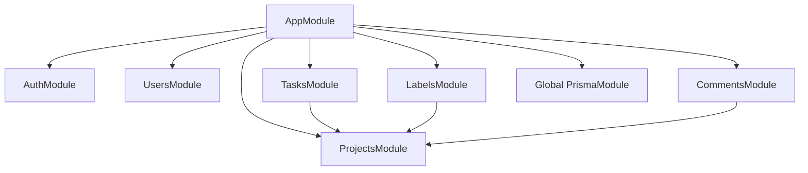

# 4. Architecture, language, and design patterns

[Home](README.md) · [Bootstrap](05-application-bootstrap.md) · [Testing](13-testing.md)

## Layers and module boundaries

This is a feature-organized modular monolith with controller/service/data-access layers. A monolith means these modules are built and deployed as one application. Modularity means related responsibilities are grouped and provider visibility is declared. It does not imply separate databases or independently deployed services.



Arrows represent module imports. Projects exports ProjectMemberGuard and ProjectsService. Child features import ProjectsModule to use the shared project functionality. PrismaModule is global and exports PrismaService, so feature modules do not repeat that import. Configuration is global too.

Controllers such as [TasksController](../src/tasks/tasks.controller.ts) define route paths and extract body, parameters, and current user. [TasksService](../src/tasks/tasks.service.ts) checks business rules and queries Prisma. The shared [PrismaService](../src/prisma/prisma.service.ts) wraps connection lifecycle through inheritance from PrismaClient. There is no additional repository interface or domain aggregate layer; calling this clean/hexagonal architecture would overstate the evidence.

## Dependency injection, practically

```ts
constructor(private readonly prisma: PrismaService) {}
```

This combines two ideas. TypeScript's constructor parameter property declares and initializes a property; Nest's dependency injection supplies the actual PrismaService instance. The controller/service does not construct a database connection for every request. Registered providers are normally shared instances within the application context.

`@Injectable()` identifies classes as providers with injectable metadata; `@Module()` lists providers, controllers, imports, and exports. If a dependency is not registered/visible, startup fails with a dependency-resolution error. The global Prisma module reduces repeated wiring, but also makes database dependencies less explicit in each feature module.

The task unit test replaces the PrismaService token with `useValue: prismaMock`. That is the practical benefit: test business decisions without a database. Coupling still exists to Prisma's method shapes; there is no promise of effortless ORM replacement.

## Framework concepts in this repository

| Concept          | General purpose                                | Here                                             |
| ---------------- | ---------------------------------------------- | ------------------------------------------------ |
| Controller       | Map HTTP requests to operations                | Feature `*.controller.ts`                        |
| Provider/service | Reusable injectable behavior                   | Feature `*.service.ts`                           |
| Guard            | Decide whether execution may proceed           | JwtAuthGuard, ProjectMemberGuard, ThrottlerGuard |
| Strategy         | Supply an authentication algorithm to Passport | JwtStrategy extends PassportStrategy(Strategy)   |
| Pipe             | Transform/check handler arguments              | ValidationPipe, ParseUUIDPipe                    |
| Middleware       | Handle raw request before route execution      | RequestLoggerMiddleware                          |
| Interceptor      | Wrap handler execution and result stream       | LoggingInterceptor, TransformInterceptor         |
| Filter           | Turn selected exceptions into HTTP responses   | PrismaExceptionFilter                            |
| Decorator        | Attach metadata or extract parameters          | Public, CurrentUser, Controller, Body            |
| Lifecycle hook   | Participate in startup/teardown                | PrismaService onModuleInit/onModuleDestroy       |

Removing a guard removes an access decision; removing a pipe removes runtime input enforcement. Removing an interceptor changes response/logging behavior. These are not interchangeable extension points.

## Language, library, and runtime behavior

`async` functions return Promises; `await` suspends that function until a result or rejection, allowing Node to serve other work during I/O. It does not turn an operation into a durable background job. AuthService awaits hashing and database work before returning a token.

TypeScript interfaces (`AuthUser`, `JwtPayload`) and generics (`TransformInterceptor<T>`) are erased during compilation. They help developers and the compiler, not the HTTP caller. DTO classes and decorators supply runtime metadata; class-validator and class-transformer implement actual checking/conversion. PostgreSQL enums and foreign keys enforce a different layer after a query reaches the database.

The project uses ESM (`type: module`) and NodeNext resolution. Source imports ending in `.js` refer to the emitted runtime modules even when authoring `.ts` files. `import type` disappears from JavaScript. Do not replace runtime DTO class imports with type-only imports if a framework needs the class metadata.

Inheritance appears in PrismaService extending PrismaClient, JwtAuthGuard extending Passport's guard, QueryTaskDto extending PaginationQueryDto, and mapped update DTOs. Composition appears in modules assembling providers and services receiving dependencies. The object spread in task filtering conditionally adds query criteria; it is JavaScript object construction, not Nest behavior.

RxJS Observables represent the interceptor result stream. `map` changes each emitted result into `{ data: result }`; `tap` observes emissions for logging without changing them. A Promise from a service can participate in Nest's stream processing. Exceptions do not become successful `data` values.

## Patterns and tradeoffs

The controller/service split separates HTTP from business/database operations. DI makes dependencies replaceable in tests. Passport provides a concrete strategy extension point. DTO inheritance reduces repeated validation rules. The global response interceptor applies a shared concern once (DRY), while explicit `select` clauses avoid accidental password-hash exposure.

A likely reason for Prisma is convenient typed relational queries and migration tooling; the tradeoff is ORM-specific services and generated-client synchronization. UUIDs permit independent ID generation; they cost more space than small integers and do not replace authorization. PostgreSQL offers foreign keys and atomic transactions; changing to a nonrelational store would require rethinking these guarantees.

## Common mistakes

- Assuming a TypeScript interface validates incoming JSON.
- Constructing a new PrismaClient per request instead of using the provider.
- Calling every class abstraction a repository or every decorator the GoF decorator pattern.
- Treating `await` as a queue or as CPU parallelism.

## What to remember

- This is one process with feature boundaries and layers.
- DI controls object creation and substitution.
- Guards, pipes, interceptors, and filters run at different stages.
- Compile-time checks disappear; runtime validation remains essential.
- Framework features, language features, and library functions do different work.

## Check your understanding

1. What would break if PrismaModule stopped exporting PrismaService?
2. Why can a task unit test avoid PostgreSQL?
3. Why does a DTO need decorators when its property already says `string`?
