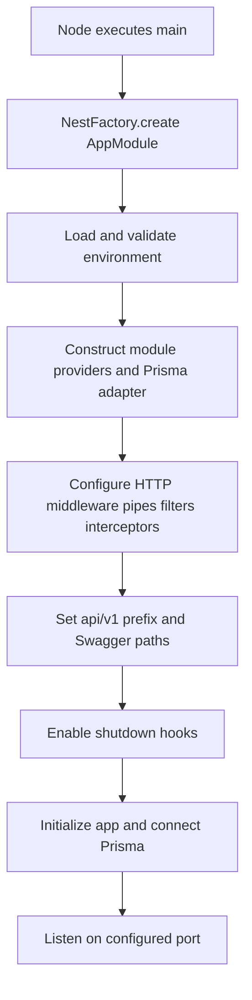

# 5. Application bootstrap

[Home](README.md) · [Configuration](06-configuration-and-environment.md) · [Request flow](12-request-lifecycle-and-data-flows.md)

Bootstrapping creates the application once; request handling reuses it many times. The entry point is [main.ts](../src/main.ts), not AppModule by itself.

The diagram separates provider construction from lifecycle initialization. `NestFactory.create` assembles the application; `listen` initializes it if needed, including `onModuleInit`. Merely creating an application object does not mean it is serving HTTP. This distinction lets the offline exporter inspect metadata without calling listen/init and without opening a database connection.

## Startup steps and why they matter

1. Import AppModule and supporting classes. AppModule imports ConfigModule with Joi validation. Invalid required settings prevent a healthy startup.
2. Construct providers. PrismaService reads `process.env.DATABASE_URL`, extracts its `schema` URL parameter (default public), and passes the URL and schema to PrismaPg. It throws immediately if the URL is missing.
3. Retrieve ConfigService from the Nest container. The bootstrap uses it for CORS origin and port.
4. Install Helmet and CORS. Helmet adds response headers; CORS defines permitted browser origin behavior and enables credentials. Neither authenticates a caller.
5. Register a global ValidationPipe with whitelist, rejection of nonwhitelisted fields, transformation, and implicit conversion.
6. Register PrismaExceptionFilter, then LoggingInterceptor and TransformInterceptor. Services can return domain/database results while these shared components handle cross-cutting HTTP behavior.
7. Prefix controller routes with `api/v1`. Create a Swagger document and mount UI at `api/docs`; Swagger setup is separate from controller prefixing.
8. Enable shutdown hooks. On framework shutdown, PrismaService's `onModuleDestroy` disconnects its client. This is lifecycle cleanup, not evidence of a complete orchestrator drain policy.
9. Read PORT (default 3000), initialize/listen, and print API/docs URLs. A caught bootstrap failure logs an error and sets `process.exitCode = 1`.

AppModule also registers JwtAuthGuard and ThrottlerGuard as global APP_GUARD providers, and applies RequestLoggerMiddleware to all routes through its configure method. These declarations are part of application construction even though they are not in main.ts.

## Initialization versus tests and exports

[HTTP tests](../test/tasks.e2e-spec.ts) create an app from AppModule and manually install only some HTTP configuration. They do not call main.ts. Consequently those tests do not fully reproduce production validation options, Helmet, CORS, Prisma filter, logging interceptor, Swagger, or shutdown-hook setup.

[The exporter](../scripts/export-api.mjs) sets fixed placeholder environment values before dynamically importing AppModule, creates an app, inspects Swagger metadata, writes JSON, then closes it. It does not call app.init or app.listen. Its responsibility is documentation, not testing connectivity.

## Common mistakes

- Thinking importing AppModule is equivalent to running bootstrap.
- Expecting successful Swagger generation to prove the database works.
- Adding global configuration only to tests and assuming production inherits it.
- Treating the public health response as a database readiness check.

## What to remember

- Bootstrap wires the shared request behavior.
- Construction and lifecycle initialization are distinct.
- Prisma connects through a lifecycle hook.
- Tests can diverge from production if they recreate bootstrap manually.
- Shutdown hooks clean up connections but do not define the whole deployment shutdown policy.

## Check your understanding

1. Why can the exporter run without PostgreSQL?
2. Which bootstrap changes would HTTP tests currently miss?
3. When is PrismaService's constructor run versus onModuleInit?
