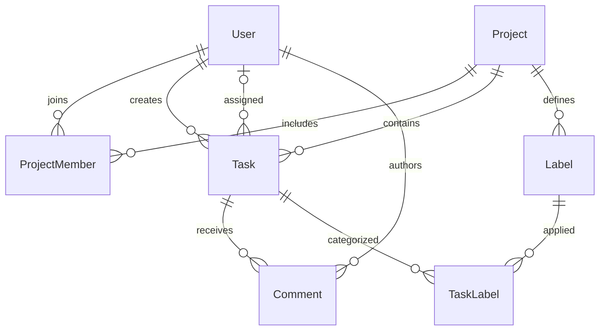

# 7. Database and data modeling

[Home](README.md) · [Projects](features/projects.md) · [Tasks](features/tasks.md)

A relational database stores records in tables and connects them through keys. Prisma represents those tables as models and generates a typed query API. The schema is the intended structure; migrations are the ordered SQL changes used to reproduce it.

Sources: [schema.prisma](../prisma/schema.prisma), [initial migration](../prisma/migrations/20260916175316_init/migration.sql), [Prisma configuration](../prisma.config.ts), and [PrismaService](../src/prisma/prisma.service.ts).

## Relationships



A project has members, tasks, and label definitions. A task has one creator and optionally an assignee. Users may belong to many projects, and tasks may have many labels: explicit join models represent both many-to-many relationships. The database permits a project with no memberships even though project creation inserts its initial owner.

## Every model

| Model         | Identity and fields                                                                                                                                    | Why it exists / runtime use                                      |
| ------------- | ------------------------------------------------------------------------------------------------------------------------------------------------------ | ---------------------------------------------------------------- |
| User          | UUID-like string id; unique email; passwordHash; name; createdAt/updatedAt                                                                             | Credentials and identity for memberships, authorship, assignment |
| Project       | id; name; optional description; timestamps                                                                                                             | Container for collaboration                                      |
| ProjectMember | id; projectId; userId; role default MEMBER; joinedAt                                                                                                   | Membership with its own role/history                             |
| Label         | id; name; color default #6B7280; projectId; createdAt                                                                                                  | Project-specific classification                                  |
| Task          | id; title; optional description; status default TODO; priority default MEDIUM; optional dueDate; timestamps; projectId; creatorId; optional assigneeId | The work item                                                    |
| TaskLabel     | composite primary key taskId + labelId                                                                                                                 | Prevent duplicate attachment of the same label                   |
| Comment       | id; body; timestamps; taskId; authorId                                                                                                                 | Discussion attached to a task                                    |

There is no `ownerId` on Project: ownership is a role on ProjectMember. A task's creator and assignee are different relationships to User, named TaskCreator and TaskAssignee in Prisma to disambiguate them. TaskLabel has no independent generated id.

The migration stores IDs as PostgreSQL TEXT, not native UUID columns. Prisma's `uuid()` defaults generate IDs through Prisma; the SQL id columns do not contain a database UUID default. Similarly, `@updatedAt` is maintained through Prisma writes, whereas createdAt uses a database CURRENT_TIMESTAMP default. Raw SQL writers must account for these differences.

## Constraints, indexes, and invariants

| Definition                                                    | Guarantee or access path                                                   |
| ------------------------------------------------------------- | -------------------------------------------------------------------------- |
| User.email unique                                             | One row for an exact email value; application does not normalize email     |
| ProjectMember(projectId, userId) unique                       | A user has at most one membership per project                              |
| Label(projectId, name) unique                                 | A label name may recur in different projects                               |
| TaskLabel(taskId, labelId) primary key                        | A task-label pair cannot repeat                                            |
| ProjectMember.userId index                                    | Helps listing memberships/projects by user                                 |
| Task projectId, assigneeId, status, priority, dueDate indexes | Separate indexes for common selection fields                               |
| Comment.taskId index                                          | Helps task discussion lookup                                               |
| TaskLabel.labelId index                                       | Helps traversal from label to linked tasks                                 |
| Project.name index                                            | Available name lookup index, although project list does not filter by name |

User.email also has a separate nonunique index in addition to its unique index; this is a candidate for reviewing redundant index cost. An index improves some reads at the cost of disk and write maintenance. Separate task indexes do not guarantee optimal combined project/filter/order queries; inspect query plans before adding indexes.

A foreign key guarantees a referenced row exists. It does not enforce that a task's assignee is a member or that an attached label belongs to the same project. TasksService enforces those rules. Other gaps, such as removing an assigned user's membership without unassigning tasks, remain possible.

## Deletion behavior

Deleting a project cascades to its memberships, labels, and tasks. Deleting tasks cascades to comments and TaskLabel rows; deleting labels cascades to their TaskLabel rows. This is physical deletion, not soft deletion or archival.

Deleting a user cascades memberships and sets assignee references to null, but creator/author references are RESTRICT in the migration. Existing created tasks or authored comments can therefore block user deletion. There is no user-delete HTTP endpoint; this matters for maintenance and test cleanup. Tests delete projects before users so dependent tasks/comments disappear first.

## Queries as SQL concepts

AuthService's `user.findUnique({ where: { email } })` is conceptually:

```sql
SELECT * FROM "User" WHERE "email" = $1 LIMIT 1;
```

The parameter is supplied separately through the query machinery, rather than interpolating user input into raw SQL. The actual generated SQL may differ.

Listing your projects with `members: { some: { userId } }` means selecting projects for which a matching membership exists. Filtering tasks by label uses an analogous existence condition on TaskLabel. `include` requests related data; `select` chooses specific columns. The ORM may implement relation loading with multiple SQL operations, so do not infer an exact query count merely from one method call.

Pagination maps to a bounded query plus a count:

```sql
SELECT * FROM "Task"
WHERE "projectId" = $1
ORDER BY "createdAt" DESC
LIMIT $2 OFFSET $3;
```

The API additionally applies optional filters and relation includes. Skip is `(page - 1) * limit`.

## Atomicity and transaction boundaries

ProjectsService.create uses a nested write for project plus OWNER membership. Both succeed together or fail together. Without atomicity, a project could be created without anyone able to access it.

Task/comment lists use `$transaction([findMany, count])`. This groups operations, but no custom isolation level is selected; under ordinary PostgreSQL READ COMMITTED behavior the two statements are not a guarantee of one immutable snapshot during concurrent writes. This is not the same as transactionally enforcing a business invariant.

Assignment and label attachment perform reads/checks before a separate write. Membership can change between check and write. Transactions and stronger constraints may be needed if concurrent enforcement matters. Upsert avoids duplicate membership/label-link creation through a unique selector; it does not add caller permissions.

## Schema lifecycle

There is one committed initial migration and a PostgreSQL migration lock file. Generate a migration in development, inspect its SQL, regenerate the client, test against a migrated database, and deploy the committed migration. Schema push is useful for disposable experimentation but does not produce the same audit trail. The seed is optional and partly idempotent; [setup](02-project-setup.md) describes its caveats.

## Common mistakes

- Confusing a Prisma relation with an authorization rule.
- Assuming UUID-looking IDs use a native database UUID type.
- Assuming every default is executed by PostgreSQL.
- Treating a multi-query transaction as an automatic concurrency solution.
- Deleting a project without recognizing its cascade scope.

## What to remember

- Seven models describe identity, collaboration, work, and discussion.
- Explicit join tables capture membership data and unique label links.
- Foreign keys and uniqueness protect structural integrity.
- Services must enforce cross-resource business relationships.
- Migrations, generated client code, and seed data serve separate purposes.

## Check your understanding

1. Why can the database store a nonmember assignee despite its foreign key?
2. Why is ProjectMember not an implicit join relation?
3. What disappears when a project is deleted?
4. Why might page items and total disagree briefly under concurrent writes?
