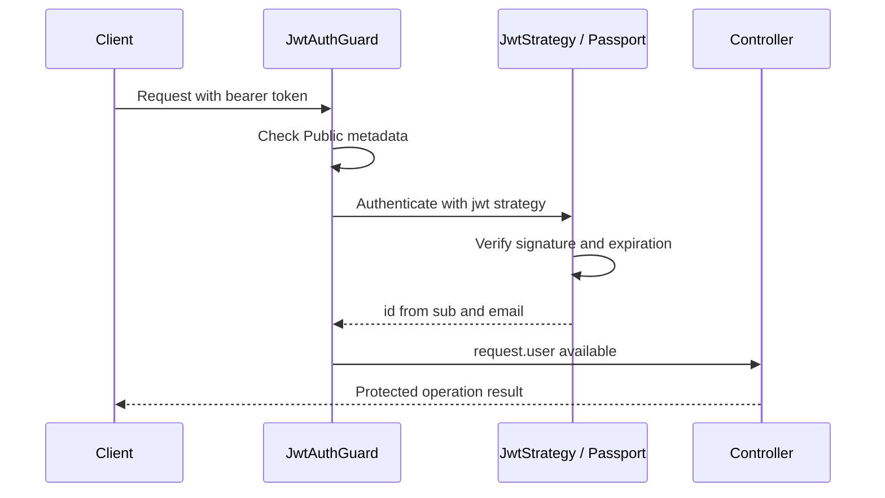

# 8. Authentication

[Home](README.md) · [Authorization](09-authorization-and-security.md) · [Request walkthroughs](12-request-lifecycle-and-data-flows.md)

Authentication answers “who is making this request?” This API verifies a password at login and then accepts a signed bearer token for later requests. Authorization separately decides what that identity may do.

Implementation: [AuthController](../src/auth/auth.controller.ts), [AuthService](../src/auth/auth.service.ts), [AuthModule](../src/auth/auth.module.ts), [JwtStrategy](../src/auth/strategies/jwt.strategy.ts), [JwtAuthGuard](../src/auth/guards/jwt-auth.guard.ts).

## Registration and password storage

POST `/api/v1/auth/register` is public. RegisterDto requires a valid email, a string name of at least two characters, and a string password of at least eight. Global validation rejects unknown fields; callers cannot submit their own role or passwordHash.

AuthService.register first looks up the email. An existing user causes ConflictException (409). Otherwise bcrypt hashes the password with cost 10 and the service inserts email, name, and passwordHash. It immediately issues an access token; email verification is **not currently implemented**.

A hash is a one-way verifier, not encrypted text to decrypt later. bcrypt generates a salt as part of hashing with a cost value; the stored hash encodes the information needed for comparison. Salts prevent identical passwords simply producing identical stored values, while cost makes guessing more expensive. The raw password is not stored in the User model.

The initial existence query is helpful for a friendly message, but two registrations can race. The database's unique email constraint remains the final arbiter; its P2002 error is mapped to 409 by the global Prisma filter.

## Login

POST `/api/v1/auth/login` takes LoginDto: valid email and string password. It does not repeat registration's minimum password-length rule. The service finds the user, compares the supplied password using bcrypt.compare, and throws the same “Invalid credentials” 401 message for missing users and incorrect passwords. Matching credentials produce the same auth response as registration.

Successful response shape (201 for register, explicitly 200 for login):

```json
{
  "data": {
    "accessToken": "<jwt>",
    "user": {
      "id": "<user-id>",
      "email": "learner@example.com",
      "name": "Learner"
    }
  }
}
```

AuthService deliberately constructs the safe user object; TransformInterceptor supplies the outer data wrapper. Neither operation returns passwordHash.

## JWT anatomy and configuration

A JWT has encoded header, payload, and signature segments. The header identifies signing metadata; the payload carries claims; the signature lets the verifier detect tampering with a trusted key. Encoding is not encryption: do not place secrets in token claims.

`buildAuthResponse` signs `{ sub: id, email }` using JwtService. The library adds standard timing claims according to its signing behavior and configured expiration. AuthModule supplies JWT_SECRET and JWT_EXPIRES_IN, defaulting the latter to 15m through environment validation. No custom issuer, audience, or explicit algorithm restriction is configured in the application.

The client sends `Authorization: Bearer <jwt>`. “Bearer” means possession grants use; the API does not bind the token to a particular browser or device. TLS and careful client token handling are deployment/client responsibilities not implemented by the token string itself.

## Verification flow



For a protected request, Passport extracts the token from the header and validates it with the configured secret, with expiration checks enabled. JwtStrategy.validate returns `{ id: payload.sub, email: payload.email }`; Passport attaches it to request.user. [CurrentUser](../src/auth/decorators/current-user.decorator.ts) reads that value for controller arguments.

The global guard checks [Public metadata](../src/auth/decorators/public.decorator.ts) on method and controller. Public registration, login, and health skip JWT verification, but do not skip the separate throttling guard. Swagger UI is registered separately from these controller guards.

The strategy does not query User, verify account existence, refresh the email, or check a token revocation store. The JwtPayload interface is a TypeScript declaration, not a runtime schema for claims. Tokens for deleted accounts may pass authentication and fail later operations; some read paths may still succeed without touching that user row.

## Token lifecycle and tradeoffs

Refresh tokens, server-side sessions, cookies, logout/revocation, password reset/change, OAuth, account lockout, and email verification are **not currently implemented**. After expiry, the user logs in again. Deleting a token from a client does not invalidate another copy. Changing the signing secret invalidates all tokens using the previous key.

A likely reason for bearer JWTs is simple API-client integration and verification without a per-request session lookup. The cost is difficult selective revocation and potentially stale claims. Project membership is still read from the database for guarded project operations, so removing membership affects subsequent requests independently of token expiry.

## Common mistakes

- Treating JWT payloads as secret because they look encoded.
- Returning the complete User row from login.
- Treating a valid token as permission to any resource.
- Assuming client logout revokes a stolen token.
- Confusing documentation bearer metadata with an actual auth guard.

## What to remember

- Passwords are compared against bcrypt hashes, not decrypted.
- Registration issues a token immediately.
- The JWT guard is global and public routes opt out.
- Signature/expiry checks produce request.user; no user lookup occurs in JwtStrategy.
- Access tokens expire, and there is no refresh or revocation flow.

## Check your understanding

1. Why does registration still need a unique database constraint?
2. Which operation attaches request.user?
3. What happens if a member is removed while their token is still valid?
4. Why does changing a profile name not require changing token claims?
