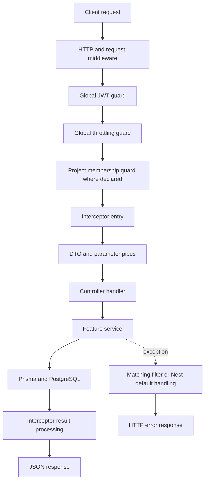
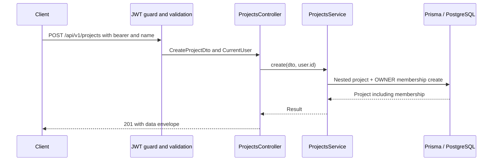

# 12. Request lifecycle and data flows

[Home](README.md) · [Bootstrap](05-application-bootstrap.md) · [Errors](10-validation-responses-and-errors.md)

## The shared request path

This follows the declarations in AppModule and main.ts. Global JWT/throttling precede route membership guards; guards precede argument pipes. Public metadata bypasses JWT only. Errors may originate earlier than the service as well. Successful results flow back through interceptors in wrapping order; TransformInterceptor wraps data, and LoggingInterceptor observes success. A guard rejection never reaches the controller or its service.

There is no custom repository class between services and Prisma, and no event/queue after database writes. Each walkthrough below identifies all applicable stages, including when a stage does no additional work.

## Walkthrough 1: register and log in

1. **Client:** POST `/api/v1/auth/register` with name/email/password.
2. **Authentication/authorization:** AuthController.register has Public metadata; JWT is skipped, throttling remains. There is no project authorization.
3. **Validation:** RegisterDto and the global pipe check email and minimum lengths and reject extra fields.
4. **Controller/service:** register passes the DTO to AuthService.register; the service checks email uniqueness and hashes the password with bcrypt cost 10.
5. **Database:** findUnique by email, then User create. The database unique constraint protects against concurrent duplicates.
6. **Side effects:** one stored account, no email or background event.
7. **Response:** JwtService signs sub/email with expiration; safe user fields and accessToken are wrapped in data and returned as 201.

Login then takes email/password via LoginDto, finds User, compares the hash, and signs another token. It does not insert a session/token record. Login returns 200; invalid credentials return 401. See [authentication](08-authentication.md) for token mechanics.

## Walkthrough 2: create a project atomically

No existing project membership is required to create a new project. JWT establishes identity, CreateProjectDto validates the name, and the nested write makes creation atomic. The only side effects are Project and ProjectMember rows. If the membership insert fails, a partial project should not survive that nested write. The service result includes memberships because the Prisma create explicitly includes them.

## Walkthrough 3: create and list tasks

**Request:** POST `/api/v1/projects/<projectId>/tasks` with title, optional priority/date/assignee. JWT supplies user identity; ProjectMemberGuard checks membership in projectId; ParseUUIDPipe and CreateTaskDto validate arguments. TasksController.create passes projectId, DTO, and creatorId to TasksService.create.

If assigneeId exists, the service verifies that target membership. The service converts dueDate to Date and creates Task with authenticated creatorId. Defaults fill TODO/MEDIUM as needed. No reminder/notification is emitted. The created row returns as data with 201; failed membership yields 403 before the insert.

**Follow-up:** GET the same collection with page/limit/status/search. The same identity/project guards run, then QueryTaskDto converts query values and supplies skip. TasksService.findAll builds a project-scoped predicate, applies filters, and requests items plus count in a transaction. It includes assignee summary and task-label definitions. The response is data.items/data.meta with 200. Reading changes no application rows.

## Walkthrough 4: assign a task

PATCH `/api/v1/projects/<projectId>/tasks/<taskId>/assign` carries `{ "assigneeId": "<userId>" }`. After JWT and URL membership checks, AssignTaskDto requires a UUID. TasksController.assign passes only taskId and DTO to TasksService.assign.

The service loads the task (404 if absent), checks assignee membership in the **actual task's** project (403 if absent), and updates Task.assigneeId. It returns the updated row in data with 200; no message is sent to the assignee.

The missing connection is authorization of the actual task against URL projectId. The member guard and assignee check each perform useful work, but together still do not prove that connection. This is why tracing parameter propagation matters more than counting guards.

## Walkthrough 5: attach a label

POST `/api/v1/projects/<projectId>/tasks/<taskId>/labels` supplies AttachLabelDto. JWT, URL membership, and DTO/UUID validation precede TasksService.attachLabel. It loads task, loads label, verifies label.projectId equals task.projectId, and upserts TaskLabel by the pair. The returned data is the link record, not a refreshed full task. HTTP status is 201 even if the link already existed. No external side effects occur. Caller-to-task parent scoping remains missing.

## Walkthrough 6: create and delete a comment

POST `/api/v1/projects/<projectId>/tasks/<taskId>/comments` passes CreateCommentDto and CurrentUser.id through CommentsController.create to CommentsService.create. Guards check identity and URL membership; validation checks body/taskId. Prisma inserts Comment and includes author id/name. The success response is data/comment with 201, without sending a notification. The task-to-project relationship is not checked.

DELETE the corresponding `.../comments/<commentId>` route. After the same guards and commentId parsing, CommentsService.remove deletes by commentId alone and returns the deleted record with 200. It does not validate comment-to-task linkage or authorship. P2025 yields 404 for missing comment IDs. A secure future version must preserve both parent relationships and the chosen deletion policy.

## Walkthrough 7: delete a project

DELETE `/api/v1/projects/<id>` runs JWT, project membership, and UUID parsing, then ProjectsService.remove calls project.delete. PostgreSQL cascades memberships, tasks, comments, labels, and task-label links. The returned deleted Project row is wrapped with 200; affected child rows are not separately returned. There is no audit event or undo facility. Every member can currently invoke it, so owner-only authorization is a high-priority improvement.

## Common mistakes

- Placing validation before guards in mental models of Nest execution.
- Assuming the entire URL is passed to every service automatically.
- Assuming a service return value already includes the data envelope.
- Looking only at the happy path when tracing a feature.

## What to remember

- Trace actual arguments from route through service to query.
- Authentication and project membership run before handler DTO pipes.
- Services return values; interceptors shape successful HTTP output.
- Database writes are the implemented side effects.
- Missing parameter propagation often reveals missing security scope.

## Check your understanding

1. At which stage does a bad assignee fail, and has any task been inserted yet?
2. Why does label attachment return a link rather than a Task?
3. Which project-delete consequences happen inside the database rather than explicit service loops?
