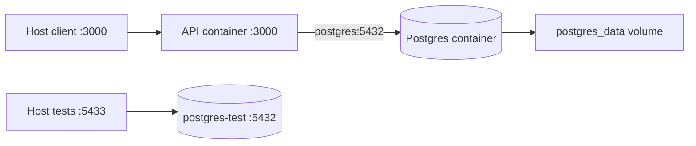

# 15. Docker and containers

[Home](README.md) · [Setup](02-project-setup.md) · [CI/deployment](16-ci-cd-and-deployment.md)

An image is a packaged filesystem and execution configuration. A container is a running instance of that image. A volume stores data outside the replaceable container filesystem. [Dockerfile](../Dockerfile) builds the API image; [docker-compose.yml](../docker-compose.yml) describes local cooperating services.

## Dockerfile, instruction by instruction

| Instruction/stage                    | Project behavior                                    | Why it exists                                                     |
| ------------------------------------ | --------------------------------------------------- | ----------------------------------------------------------------- |
| FROM node:24.20.0-alpine AS builder  | Node/Alpine build environment                       | Consistent runtime/toolchain base                                 |
| WORKDIR /app                         | Establish working directory                         | Relative operations target one app folder                         |
| COPY package*.json and prisma        | Copy dependency manifests and schema                | Install dependencies before most source changes invalidate layers |
| RUN npm ci                           | Install locked full dependencies                    | Build needs CLI and TypeScript                                    |
| COPY . .                             | Copy remaining allowed context                      | Supply source/configuration                                       |
| RUN DATABASE_URL=... prisma generate | Generate client with a placeholder URL              | CLI config requires a URL; generation does not connect            |
| RUN npm run build                    | Compile application                                 | Runner executes JS, not TypeScript source                         |
| FROM ... AS runner                   | Fresh runtime stage                                 | Avoid carrying all builder files/tools                            |
| ENV NODE_ENV=production              | Runtime environment label                           | Supply production default                                         |
| addgroup/adduser                     | Create nestjs user                                  | Avoid running the app as root                                     |
| npm ci --omit=dev                    | Install runtime dependencies                        | Exclude development tools                                         |
| COPY generated .prisma, config, dist | Bring generated client and compiled app             | Runtime and migration CLI need these artifacts                    |
| USER nestjs                          | Set process identity                                | Reduced OS privilege                                              |
| EXPOSE 3000                          | Document container port                             | Does not publish a host port itself                               |
| HEALTHCHECK                          | wget health every 30s, timeout 5s, start period 10s | Detect HTTP liveness failure                                      |
| CMD                                  | sh -c: prisma migrate deploy && node dist/main.js   | Migrate successfully before serving                               |

Each build instruction can form a cacheable layer. Copying dependency files before frequently changing source reduces unnecessary installation when cache is usable. Prisma stays in production dependencies because the runtime startup command executes its migration CLI. The seed runner tsx is a development dependency; do not assume production images can run the development seed.

`.dockerignore` excludes dependencies, build output, Git metadata, private environment files, and temporary/tool directories. Only the environment example is re-included among .env files. No custom ENTRYPOINT is defined in this Dockerfile. The shell-form orchestration inside CMD deserves signal-forwarding review: explicit shell `exec` or a dedicated entry script would make application process handoff clearer.

> **Source discrepancy:** The root README says the standalone image does not migrate. The current Dockerfile does: its CMD invokes `npx prisma migrate deploy` before Node. This guide follows the Dockerfile. Compose overrides CMD but also migrates first.

## Compose services

| Service       | Port/network                                 | State and health                                               |
| ------------- | -------------------------------------------- | -------------------------------------------------------------- |
| postgres      | Host 5432 → container 5432                   | postgres_data named volume; pg_isready; restart unless-stopped |
| api           | Host 3000 → container 3000                   | Waits for healthy postgres; restart unless-stopped             |
| postgres-test | Loopback 5433 → container 5432; test profile | Dedicated test DB, no named volume declared; pg_isready        |

Compose creates the default project network because no custom network is declared. Inside api, hostname `postgres` resolves the database service. `localhost` there means the API container itself. A host-run API instead connects through the published host port, normally localhost:5432. Host-run tests use localhost:5433.

Compose's API command is `sh -c "npm run prisma:migrate:deploy && node dist/main.js"`. The `&&` prevents starting the app after a failed migration. depends_on with service_healthy controls startup dependency readiness; it is not ongoing dependency monitoring or automatic application readiness gating.

The API environment entries are literal development examples. Editing `.env` alone does not override them. The primary database port is broadly published by the file, while the test port binds loopback. Review network exposure before reusing this configuration elsewhere.



Production-like API traffic and test traffic go to separate database services. The named volume keeps development data when containers are replaced; it is not a backup.

## Local workflow

```sh
docker compose up --build -d
docker compose ps
docker compose logs --tail=100 api
docker compose down
```

`up --build` builds/starts ordinary services (the test-profile database is excluded unless requested). `ps` shows service state, logs reveals migration/startup errors, and down removes containers/network while preserving named volumes by default. Do not add `--volumes` unless you intend to remove persistent development data.

## Common mistakes

- Treating EXPOSE as publishing a port.
- Connecting from api to localhost for the database.
- Treating a volume as disaster-recovery backup.
- Expecting host .env edits to replace literal container environment values.
- Assuming Docker healthy means every database-dependent endpoint works.

## What to remember

- Multi-stage build separates compilation from runtime packaging.
- The image and Compose both migrate before starting Node.
- Service DNS is different from host networking.
- Database persistence needs a volume and an independent backup plan.
- Health, startup dependencies, and readiness are distinct.

## Check your understanding

1. Why is Prisma CLI a production dependency?
2. What happens if startup migration fails?
3. Which development data survives ordinary compose down?
