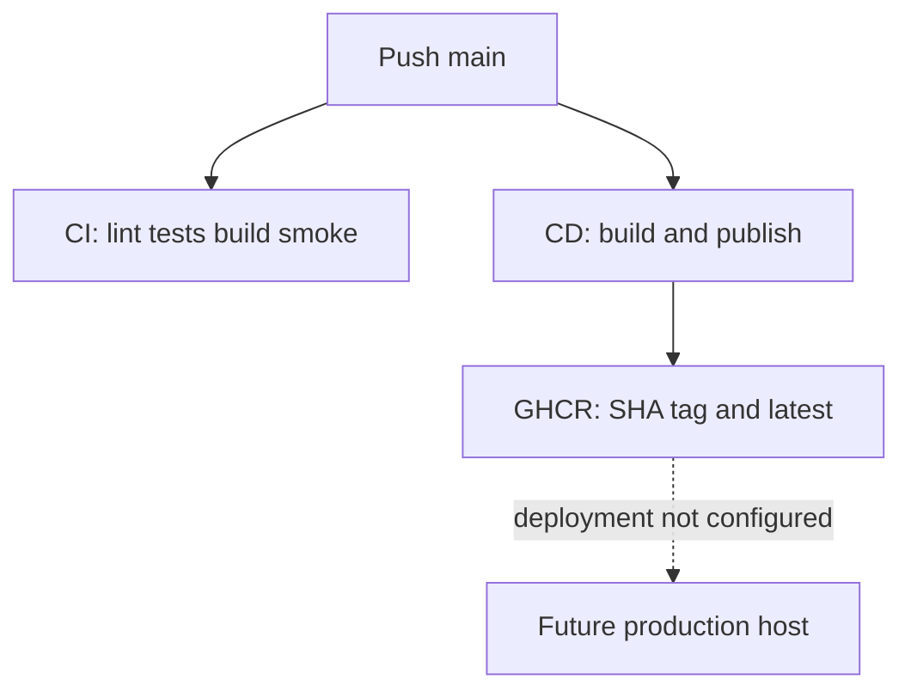

# 16. CI, image publishing, and deployment

[Home](README.md) · [Docker](15-docker-and-containers.md) · [Production readiness](17-production-readiness.md)

Continuous integration validates changes in a clean environment. Continuous delivery prepares releasable artifacts. Deploying those artifacts to a running host is a further action. This repository has validation and image publication workflows; it does not define a production host rollout.

## CI workflow

Source: [.github/workflows/ci.yml](../.github/workflows/ci.yml). Triggers are push and pull_request for main/develop. One job named test runs on ubuntu-latest. A PostgreSQL 17 Alpine service initializes a dedicated test database, publishes port 5432, and is health-checked with pg_isready.

The job environment supplies DATABASE_URL and TEST_DATABASE_URL pointing at that service, plus JWT and CORS test configuration. Both database variables matter because test/setup.ts replaces the application DATABASE_URL from the test-specific variable.

Steps run in this order:

1. Checkout using actions/checkout@v7.
2. Set Node 24.20.0 using actions/setup-node@v7 with npm cache.
3. Install locked dependencies with npm ci.
4. Generate Prisma Client and apply committed migrations.
5. Run lint, default tests (unit/integration), and separate HTTP tests.
6. Compile the app with npm run build.
7. Build a local image tagged task-management-api:ci.
8. Run that image with a migration command, forwarding DATABASE_URL on Linux host networking.
9. Start the image's default command, forwarding DB/JWT/CORS settings; retry the public health URL up to 30 times with two-second sleeps.
10. Always attempt smoke-container cleanup, even if an earlier step failed.

A failing ordinary step prevents later ordinary steps in this job. The explicit cleanup has `if: always()`. The image migration check uses the production dependency set and copied Prisma artifacts; the startup check also exercises the default image command, which currently runs migrations again before Node. This catches packaging problems not visible to source tests.

CI does not explicitly run the typecheck script or coverage command; the build provides a compilation check, and lint is type-aware. It does not publish its locally built image or upload a declared artifact. Health success proves HTTP startup, not every production feature.

## CD workflow

Source: [.github/workflows/cd.yml](../.github/workflows/cd.yml). On pushes to main, a separate ubuntu-latest job checks out the repository, initializes Buildx, logs into ghcr.io with github.actor and secrets.GITHUB_TOKEN, computes image metadata, and builds/pushes an image.

The image name is `ghcr.io/${{ github.repository }}`: it follows the repository owner/name rather than a hard-coded owner. Metadata generates a SHA-derived tag and latest. Permissions grant contents read and packages write. The token is a publishing credential, not an API runtime secret.

The parallel branches are significant: CD has no dependency on successful CI in these workflow files. An image can be published while CI is failing. Branch protections may exist outside the repository, but are not evidenced here. Publication does not update a running server.

## Deployment evidence and gaps

The repository provides a runnable container and local Compose stack. `npm run deploy` maps to `nest deploy`, and @nestjs/mau is installed as a development dependency, but no deployment target, domain, production database, host secrets, or rollout configuration is supplied here. Assistant skill files are not evidence of deployed Prisma services. No platform-specific deployment is claimed.

TLS termination, reverse proxy, DNS, readiness routing, backup schedules, production monitoring, registry pull credentials, and rollback automation are **not currently implemented in repository configuration**. They may be configured externally, but cannot be reconstructed from these files.

## A proposed release procedure (not an existing workflow)

1. Repair the high-priority authorization issues and pass targeted regression tests.
2. Gate publication/promotion on CI success for the exact commit.
3. Provision PostgreSQL, private network access, and environment secrets on the chosen host.
4. Review migration impact and verify backups/restore; decide who runs migrations before multiple replicas start.
5. Deploy a specific immutable image digest or verified SHA tag, avoiding ambiguity from a moving latest tag.
6. Check database readiness and representative authenticated operations, then route traffic through HTTPS.
7. Observe failures/latency and retain the previous artifact for application rollback.

Rolling back an application image does not reverse SQL migrations or deleted data. Prefer backward-compatible schema changes across rollout versions and prepare a recovery plan. Concurrent per-replica startup migration is a reason to consider a dedicated release migration step, but that change is not implemented here.

## Common mistakes

- Treating workflow names as proof of what they do.
- Assuming CI gates a separate CD workflow automatically.
- Deploying latest without recording the underlying digest.
- Assuming image rollback undoes database changes.

## What to remember

- CI validates source plus actual image startup/migrations.
- CD publishes a GHCR artifact independently of CI.
- GitHub job/step/service/action have distinct roles.
- No production rollout target is defined here.
- Deployment needs database, networking, secrets, verification, and recovery decisions.

## Check your understanding

1. What failure can the container migration check catch that npm test cannot?
2. Why can CD publish despite CI failure?
3. Why is a database migration rollback different from an image rollback?
